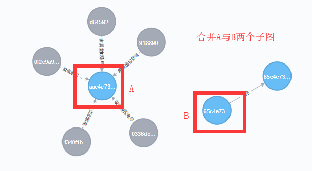
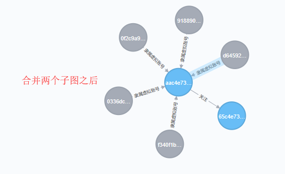
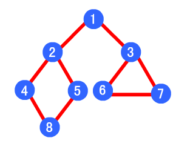
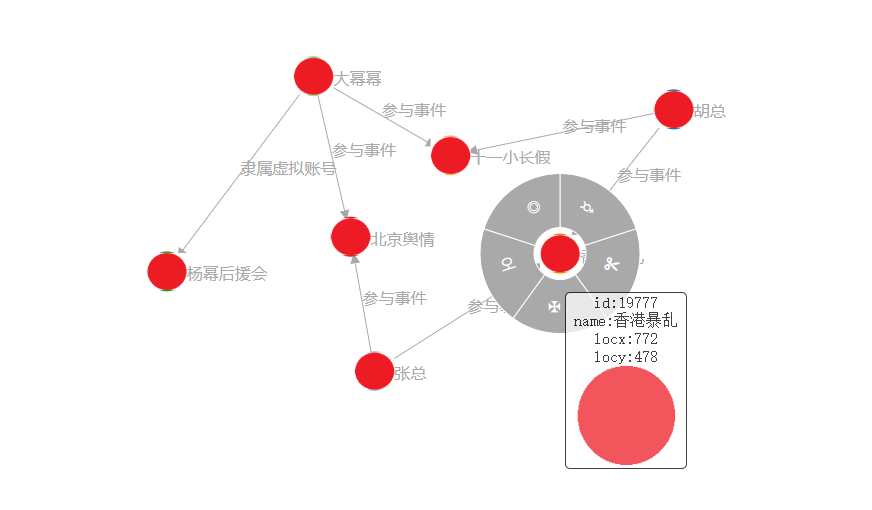
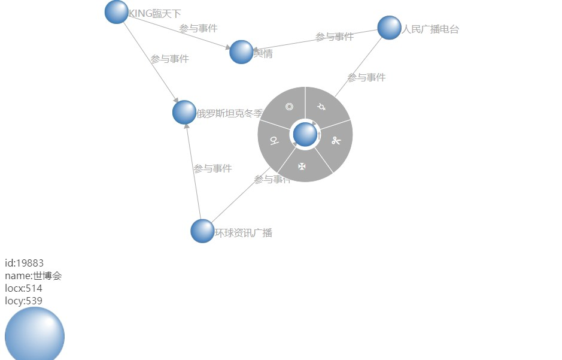
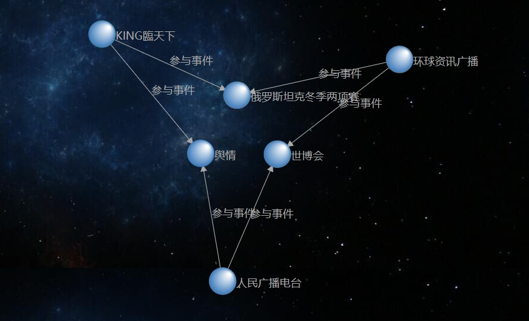

# ONgDB-LAB-VISUAL
## 可视化插件校验图分析数据
```
使用可视化插件校验图分析数据-可视化插件的使用方式（一）：
1、将查询结果进行格式转换
2、转换后的数据写入到neo-import-csv/check-graph-traversal.json文件
3、启动HTTP-SERVICE:src\main\java\data\lab\ongdb\visual\server\HttpService.java
4、双击src\main\resources\static\index.html文件使用浏览器显示

使用可视化插件校验图分析数据-可视化插件的使用方式（二）：
1、直接调用可视化插件类Visualization，传入检索插件或者分析组件的结果RESULT
2、然后双击static/index.html页面即可(new Visualization().run(reasoningDragResult))

```







